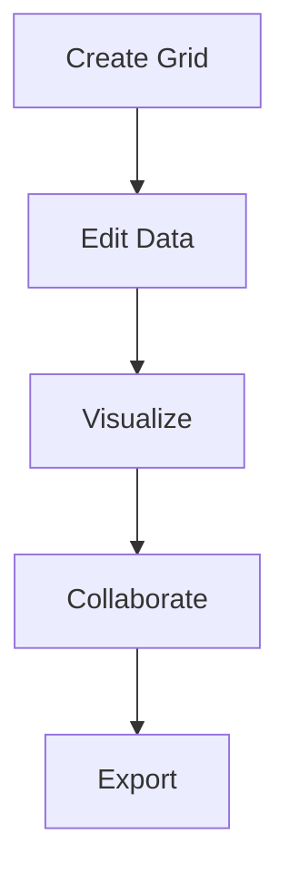

## Overview

Elfilay Filou empowers you to create, edit, visualize, collaborate on, and export grid data efficiently. Whether you manage spreadsheets, datasets, or structured grids, these core features streamline your workflow. Start by building grids from scratch or importing data, then apply visualizations and share with teams.

<Columns cols={2}>
  <Card title="Grid Creation & Editing" icon="grid" href="#grid-creation">
    Build and modify grids with intuitive tools.
  </Card>
  <Card title="Data Visualization" icon="bar-chart-3" href="#visualization">
    Transform data into charts and graphs.
  </Card>
  <Card title="Collaboration Tools" icon="users" href="#collaboration">
    Work together in real-time.
  </Card>
  <Card title="Export & Reporting" icon="download" href="#export">
    Generate reports and export formats.
  </Card>
</Columns>

## Grid Creation and Editing

Create new grids or edit existing ones using Elfilay Filou's editor. You define columns, rows, and data types with simple commands.

<Steps>
  <Step title="Initialize Grid" icon="plus">
    Start a new grid session.

````javascript
const grid = elfilay.createGrid({
  columns: ['id', 'name', 'value'],
  rows: 100
});
````
  </Step>
  <Step title="Add Data" icon="edit-3">
    Insert rows dynamically.

````javascript
grid.addRow({ id: 1, name: 'Product A', value: 150.50 });
grid.addRow({ id: 2, name: 'Product B', value: 299.99 });
````
  </Step>
  <Step title="Edit Cells" icon="save">
    Update specific cells.

````javascript
grid.setCell(0, 2, 175.75); // Update value in first row
grid.save();
````
  </Step>
</Steps>

<Callout kind="tip">
  Use `{column}` and `{row}` selectors for bulk operations to speed up editing.
</Callout>

## Data Visualization Options

Visualize your grid data with multiple chart types. Switch between options to find the best representation.

<Tabs>
  <Tab title="Bar Chart" icon="bar-chart">
    Ideal for comparing categories.

````javascript
grid.visualize('bar', {
  x: 'name',
  y: 'value',
  title: 'Sales by Product'
});
````
  </Tab>
  <Tab title="Line Chart" icon="trending-up">
    Track trends over time.

````javascript
grid.visualize('line', {
  x: 'date',
  y: 'value',
  title: 'Trend Analysis'
});
````
  </Tab>
  <Tab title="Pie Chart" icon="pie-chart">
    Show proportions.

````javascript
grid.visualize('pie', {
  key: 'name',
  value: 'value',
  title: 'Market Share'
});
````
  </Tab>
</Tabs>

## Collaboration Tools

Invite team members to edit grids in real-time. Changes sync instantly, with version history to track modifications.

<CodeGroup tabs="Invite,Share">
````javascript
// Invite user
elfilay.inviteUser('team@example.com', grid.id);
````
````javascript
// Generate share link
const link = grid.share({ readOnly: false });
console.log(`Share: ${link}`);
````
</CodeGroup>

You see live cursors and can resolve conflicts via the built-in merge tool.

## Export and Reporting

Export your grids and generate reports in various formats. Customize templates for professional outputs.

<Expandable title="Advanced Export Options" default-open="false">

```javascript
grid.export('csv', { filename: 'data.csv' });
grid.export('pdf', {
  template: 'report',
  includeCharts: true
});
```

Support formats include CSV, JSON, PDF, and Excel. For reports, add headers and footers programmatically.

</Expandable>



These features make Elfilay Filou your go-to tool for grid data mastery. Explore further in the [quickstart](/quickstart).